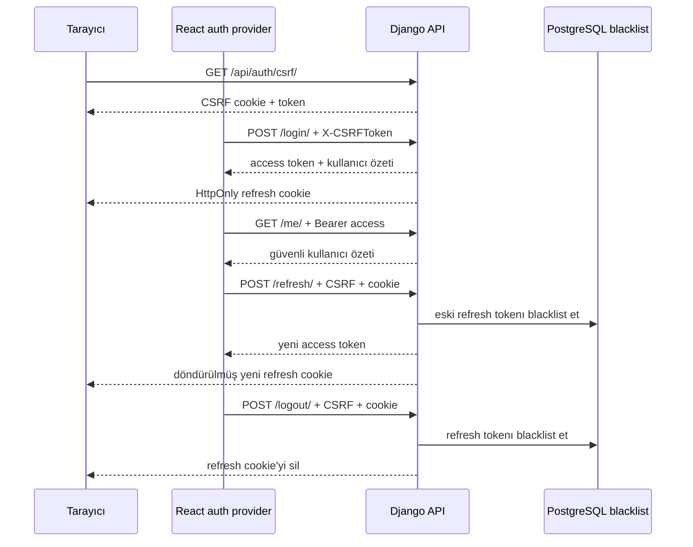

# Sprint 4 Authentication Akışı

Sprint 4, kısa ömürlü JWT access token ile HttpOnly refresh cookie kullanan
authentication temelini uygular. Production deployment henüz bu kapsamda değildir.

## Token ve cookie politikası

- Access token varsayılan 5 dakika geçerlidir, login/refresh JSON gövdesinde
  döner ve yalnız JavaScript/React belleğinde tutulur. `localStorage`,
  `sessionStorage` ve IndexedDB kullanılmaz.
- Refresh token varsayılan 1 gün geçerlidir ve JSON'a girmez. Cookie adı
  yapılandırılabilir; varsayılan `refresh_token` değeridir.
- Development cookie bayrakları: `HttpOnly`, `SameSite=Lax`, `Secure=False`,
  `Path=/api/auth/`. Production HTTPS ortamında `Secure=True` zorunludur.
- Rotation her refresh işleminde yeni token üretir ve eski tokenı Simple JWT
  blacklist tablolarına kaydeder. `flushexpiredtokens` süresi dolmuş kayıtların
  periyodik bakımında kullanılmalıdır.

## CSRF ve oturum geri yükleme

CSRF token refresh token değildir. CSRF token, tarayıcının otomatik gönderdiği
cookie ile yapılan state-changing isteğin aynı site akışından geldiğini kanıtlar;
refresh token ise oturum yetkisidir. SPA önce `GET /csrf/` çağrısıyla token ve
CSRF cookie alır, ardından login/refresh/logout POST isteklerinde
`X-CSRFToken` gönderir. Bu isteklerde `credentials: include` kullanılır.

Sayfa yenilenince access bellekten kaybolur. Auth provider refresh cookie ile
bir kez `/refresh/`, ardından yeni Bearer token ile `/me/` çağırır. Eşzamanlı
401 yanıtları tek refresh promise paylaşır; istekler yalnız bir kez tekrarlanır.
Refresh başarısızsa bellek temizlenir ve login görünür.

## Yetki ve hata sınırları

- 401: token yok, bozuk, süresi geçmiş, blacklist edilmiş veya kullanıcı pasif.
- 403: kimlik doğrulanmış kullanıcı gerekli ürün rolüne sahip değil.
- `/admin-kontrol/`, sunucuda aktif `ADMIN` policy'sini kullanır; `is_staff` veya
  `is_superuser` ürün rolünün yerine geçmez.
- Pasif kullanıcı login ve refresh yapamaz; mevcut access tokenla korumalı
  endpoint'e erişimi de JWT kullanıcı kontrolünde reddedilir.
- Logout refresh tokenı iptal eder. Access token stateless olduğu için kısa ömrü
  dolana kadar teknik olarak geçerli kalabilir; frontend hemen bellekten siler.
- Login throttle development varsayılanı `10/min`dir. Dağıtık production rate
  limit ve proxy stratejisi deployment aşamasında ayrıca değerlendirilmelidir.

## F12 demo kontrolü

1. Network panelinde `/csrf/` ardından CSRF başlıklı `/login/` çağrısını izleyin.
2. Login JSON'unda access ve kullanıcı özeti olduğunu, refresh olmadığını görün.
3. Application/Cookies alanında refresh cookie'nin HttpOnly ve auth path'li
   olduğunu doğrulayın; HttpOnly nedeniyle JavaScript okuyamaz.
4. Sayfayı yenileyip `/refresh/` ve `/me/` sırasını gözleyin.
5. Refresh sonrasında cookie değerinin döndüğünü, eski değerin kullanılamadığını
   gözlemleyin; token değerlerini kopyalamayın veya loglamayın.
6. Çıkışta cookie'nin silindiğini ve tekrar refresh'in 401 döndüğünü doğrulayın.
