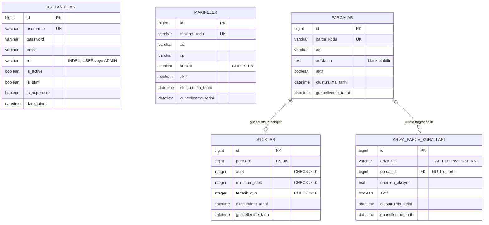

# Sprint 2 ER Diyagramı

Bu belge Sprint 2'de gerçekten uygulanan temel PostgreSQL şemasını gösterir.
Sonraki sprintlere ait tahmin, karar, iş emri, sensör ve replay tabloları henüz
uygulanmadığı için diyagramda yer almaz.

## İlişkiler ve silme davranışı

- `Parca`–`Stok` ilişkisi bire sıfır veya birdir. One-to-one alanı hem foreign
  key hem unique kısıtı üretir. Parça silindiğinde yalnız o parçanın güncel stok
  snapshot'ı `CASCADE` ile silinir.
- `Parca`–`ArizaParcaKurali` ilişkisi opsiyonel bire çoktur. Kullanımdaki bir
  kuralın anlamını sessizce kaybetmemek için bağlı parça `PROTECT` ile korunur.
- Parçasız kural desteklenir. Özellikle RNF için parça uydurulmadan “genel teknik
  inceleme” aksiyonu saklanabilir.

`null=True` veritabanında `NULL` tutulabileceğini, `blank=True` ise Django form
doğrulamasında alanın boş bırakılabileceğini belirtir. Kuralın `parca` alanında
ikisi de geçerlidir. `Parca.aciklama` metni formda boş olabilir, ancak veritabanı
kolonu `NULL` yerine boş metin kullanır.

## Constraint ve index kararları

- Makine kritikliği `makine_kritiklik_1_5` ile 1–5 arasında tutulur.
- Stok sayıları üç ayrı, açık isimli check constraint ile negatif değerlerden
  korunur.
- Makine ve parça kodlarının `unique` tanımı kendi index'ini oluşturduğu için
  ikinci index eklenmemiştir. One-to-one stok ilişkisi için de ek index yoktur.
- Arıza tipi/parça çifti benzersizdir. PostgreSQL'de `NULL` değerlerin normal
  unique constraint davranışından dolayı parçasız kurallar ayrıca koşullu
  `ariza_genel_kural_benzersiz` constraint'iyle korunur.
- Kullanıcı rolü yönetim ve yetki sorgularında filtreleneceği için indexlidir.
  Arıza kuralları çoğunlukla tip ve aktiflik birlikte kullanılarak seçileceği
  için `ariza_tipi_aktif_idx` birleşik index'i vardır. Düşük seçicilikli `aktif`
  alanlarına tek başına index eklenmemiştir.

Django `full_clean()` uygulama düzeyinde doğrulama sağlar; `save()` bunu otomatik
çağırmaz. Bu nedenle veri bütünlüğü yalnız Django validation'a bırakılmamış,
kritik kurallar PostgreSQL constraint'leriyle korunmuş ve testlerde doğrudan
`IntegrityError` davranışı doğrulanmıştır.

## Kullanıcı ve stok sınırları

`Kullanici.rol` ürün içindeki `USER`/`ADMIN` rolüdür. Django'nun `is_staff` ve
`is_superuser` alanları admin sitesine erişim ve Django yetkilendirmesi içindir;
birbirleriyle otomatik eşitlenmezler. Parolalar AbstractUser'ın hash mekanizmasıyla
saklanır.

`Stok` yalnız tek güncel snapshot'tır. Stok hareket geçmişi, giriş/çıkış kayıtları
ve denetim izi sonraki sprintlerin konusudur.
